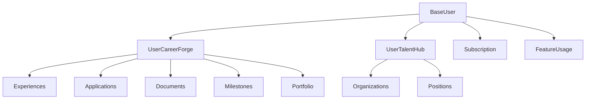

# SkillSync - Multi-platform Career Ecosystem SRD

## 1. Project Overview

A dual-platform career ecosystem with:
- **CareerForge**: Professional development platform (job seekers)
- **TalentHub**: Talent acquisition platform (recruiters)
- **AI Core**: Resume analysis, job matching, cover letter generation

## 2. System Architecture

### Core Models



### Database Models

```python
# Core User Models
class BaseUser(Base, Timestamp):
    __tablename__ = "base_users"
    
    id = Column(UUID(as_uuid=True), primary_key=True)
    auth_provider = Column(String(32), nullable=False)
    provider_uid = Column(String, nullable=False)
    platform = Column(String(32), nullable=False)  # 'careerforge' or 'talenthub'
    account_tier = Column(String(32), server_default='free')
    last_active = Column(DateTime(timezone=True))

class UserCareerForge(Base, Timestamp):
    __tablename__ = "user_careerforge"
    
    id = Column(UUID(as_uuid=True), primary_key=True)
    base_user_id = Column(UUID(as_uuid=True), ForeignKey("base_users.id"))
    email = Column(String, unique=True, index=True)
    profile_strength = Column(INTEGER, server_default='0')  # 0-100%
    parsed_resume = Column(JSONB)
    skill_vector = Column(Vector(384))  # For ML matching
    career_stage = Column(String(64))  # entry, mid, senior, expert
    industry_focus = Column(ARRAY(String))
    achievement_score = Column(INTEGER, server_default='0')

class UserTalentHub(Base, Timestamp):
    __tablename__ = "user_talenthub"
    
    id = Column(UUID(as_uuid=True), primary_key=True)
    base_user_id = Column(UUID(as_uuid=True), ForeignKey("base_users.id"))
    email = Column(String, unique=True, index=True)
    organization_id = Column(UUID(as_uuid=True), ForeignKey("organizations.id"))
    hiring_capacity = Column(INTEGER)
    recruitment_focus = Column(ARRAY(String))
    verified = Column(Boolean, server_default='false')
    talent_pipeline_size = Column(INTEGER, server_default='0')
    success_metrics = Column(JSONB)  # Stores hiring success rates
```

### Feature & Usage Models

```python
class FeatureUsage(Base, Timestamp):
    __tablename__ = "feature_usage"
    
    id = Column(UUID(as_uuid=True), primary_key=True)
    user_id = Column(UUID(as_uuid=True), ForeignKey("base_users.id"))
    resume_analysis_count = Column(INTEGER, server_default='5')
    cover_letter_credits = Column(INTEGER, server_default='10')
    job_match_searches = Column(INTEGER, server_default='50')
    ai_insights_used = Column(INTEGER, server_default='3')
    export_credits = Column(INTEGER, server_default='2')

class Subscription(Base, Timestamp):
    __tablename__ = "subscriptions"
    
    id = Column(UUID(as_uuid=True), primary_key=True)
    user_id = Column(UUID(as_uuid=True), ForeignKey("base_users.id"))
    stripe_customer_id = Column(String)
    plan_tier = Column(String(32))  # free, pro, enterprise
    billing_cycle = Column(String(16))  # monthly, annual
    amount = Column(INTEGER)
    active_until = Column(DateTime(timezone=True))
    auto_renew = Column(Boolean, server_default='true')
    payment_status = Column(String(32))
```

### Achievement System Models

```python
class Milestone(Base, Timestamp):
    __tablename__ = "milestones"
    
    id = Column(UUID(as_uuid=True), primary_key=True)
    user_id = Column(UUID(as_uuid=True), ForeignKey("user_careerforge.id"))
    milestone_type = Column(String(64))  # job_secured, skill_mastered, cert_earned
    title = Column(String(256))
    description = Column(String(1024))
    achievement_points = Column(INTEGER)
    verified = Column(Boolean, server_default='false')
    proof_url = Column(String)

class Portfolio(Base, Timestamp):
    __tablename__ = "portfolios"
    
    id = Column(UUID(as_uuid=True), primary_key=True)
    user_id = Column(UUID(as_uuid=True), ForeignKey("user_careerforge.id"))
    project_title = Column(String(256))
    description = Column(String(4096))
    technologies = Column(ARRAY(String))
    project_url = Column(String)
    github_url = Column(String)
    showcase_priority = Column(INTEGER)
    visibility = Column(String(32))  # public, private, featured
```

## 3. Technical Stack

| Component | Technology |
|-----------|------------|
| Backend | FastAPI |
| Database | PostgreSQL + SQLAlchemy |
| Cache/Queue | Redis + Celery |
| AI/ML | spaCy, sentence-transformers |
| Storage | S3 |
| Search | Elasticsearch |
| Payments | Stripe |

## 4. Key Features

### CareerForge Platform
- Resume parsing and analysis
- Skill vector generation
- Portfolio management
- Achievement tracking
- Cover letter generation
- Job matching

### TalentHub Platform
- Organization management
- Position posting
- Candidate matching
- Pipeline analytics
- Success metrics

### AI Services
- Resume parsing
- Job matching
- Cover letter generation
- Skill recommendations

## 5. API Structure

### CareerForge Endpoints
```python
@router.post("/resume/analyze")
async def analyze_resume(file: UploadFile) -> ResumeAnalysis

@router.post("/portfolio/showcase")
async def create_showcase(project: PortfolioCreate) -> Portfolio

@router.get("/achievements/progress")
async def get_achievement_progress() -> AchievementStats
```

### TalentHub Endpoints
```python
@router.post("/positions/create")
async def create_position(position: PositionCreate) -> Position

@router.get("/talent-pipeline/stats")
async def get_pipeline_stats() -> PipelineStats
```

## 6. Development Setup

```bash
# Clone repository
git clone https://github.com/username/skillsync.git
cd skillsync

# Create virtual environment
python -m venv venv
source venv/bin/activate

# Install dependencies
pip install -r requirements.txt

# Start services
docker compose up -d

# Run migrations
alembic upgrade head

# Start development server
uvicorn app.main:app --reload
```

## 7. Testing Strategy

### Unit Tests
```python
# Test AI services
def test_resume_parser():
    """Test resume parsing accuracy"""

# Test matching algorithm
def test_job_matching():
    """Test candidate-job matching"""
```

## 8. Security Features
- JWT authentication
- Role-based access control
- Rate limiting
- Input validation
- File scanning

## 9. Deployment

### Development
```bash
docker compose up -d
alembic upgrade head
pytest
```

### Production (AWS)
- ECS for containers
- RDS for PostgreSQL
- ElastiCache for Redis
- S3 for storage
- CloudFront CDN

## 10. Monitoring
- Prometheus metrics
- Grafana dashboards
- Sentry error tracking
- Activity logging

## 11. Future Enhancements
1. AI interview preparation
2. Skill assessment tests
3. Learning pathway recommendations
4. Networking features
5. Industry insights dashboard
